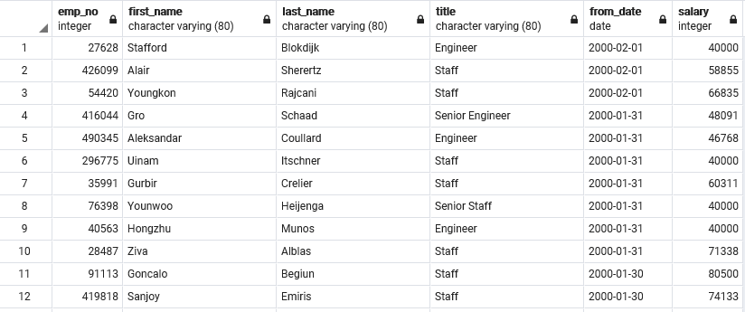
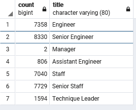
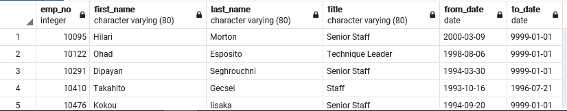
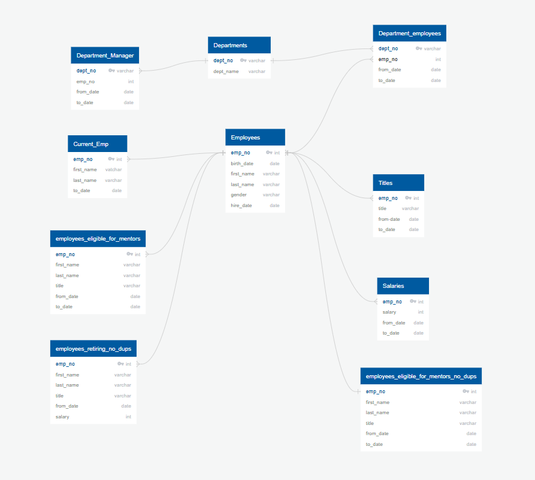

# Retirement_Analysis
pgADMIN -SQL

## Project Summary

My analysis concludes that the company will be forced to hire a considerable amount of employees over the next few years with 32859
employees who are eligible for retirement. This leaves plenty of mentors available for the 1940 current employees who arent eligible
for hire as well as the new hires for the retiring employees as they leave. We should provide further analysis on the exact date in which the employees eligible for retirement will be leaving to attempt to 
pair them up more effectively.

### Pictures of Queries
Sample of employees retiring

Total number of employees retiring by title

Sample of eligible employees for mentors

ERD of tables in Database

